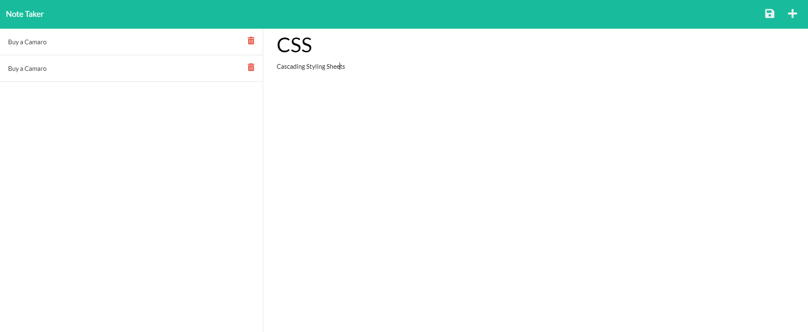

# Note Taker

## Description
An online notebook that allows you to take notes online and save and re-open them.

## Table Of Contents
* [Install](#installs)
* [Usage](#usage)
* [Heroku Link](#link)
* [license](#license)
* [Contributing](#contributing)
* [Test](#test)
* [Questions](#questions)

## Installation
Node, Express, and UUIDv4

## Usage

## Link 
https://willg-note-taker.herokuapp.com/notes
## License 

## Contributing
None needed its complete

## Tests 
Test for expected outputs based on inputs

## Questions 
[GitHub: willgresham34](https://github.com/willgresham34)   
[Email: willgresham34@gmail.com](mailto:willgresham34@gmail.com)
    
